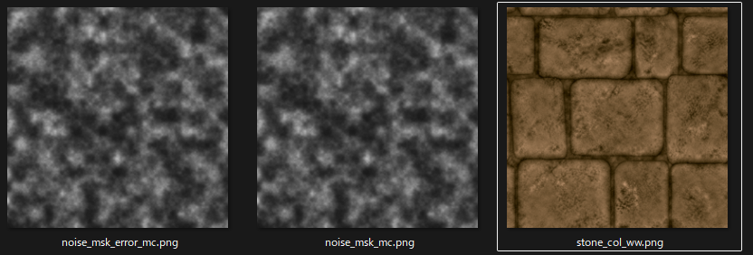

# Textureのプロパティ設定ツールを作った話

---

# 作ったもの紹介

---
## テクスチャの設定をインポート時に自動で設定できるツール
設定できるもの
- アドレス設定
- ゲーム中の最大解像度
- 2の累乗の強制フラグ
- 圧縮フォーマット
- sRGBフラグ
- Mip設定
- テクスチャグループ
- SubUV使用時の最大解像度

---
## 設定をjsonファイルに記述して
```
   "texture_config": {
        "col": {
            "address_u": "WRAP", 
            "address_v": "WRAP", 
            "max_in_game": 1024, 
            "enforce_pow2": true, 
            "compression": "BC7", 
            "srgb": "ON", 
            "mip_gen": "FROM_TEXTURE_GROUP", 
            "texture_group": "EFFECTS"
        }, 
        "msk": {
            "address_u": "WRAP", 
            "address_v": "WRAP", 
            "max_in_game": 1024, 
            "enforce_pow2": true, 
            "compression": "ALPHA", 
            "srgb": "OFF", 
            "mip_gen": "NO_MIPMAPS", 
            "texture_group": "EFFECTS"
        }
   }
```
---

## ファイルにサフィックスを設定すると


---
<div style="text-align:center;">
  <video src="img/demo.mp4" controls style="width:60%; height:auto;"></video>
</div>

---
# ポイント

---

## 設定は jsonファイルに集約
- 設定をjsonファイルに集約
- 変更時や確認時にエディタを立ち上げる必要なし
- 設定ファイル一つで他プロジェクトに共有可能
---
## Unreal依存の処理は最小限に
- ツールの性質上必要な処理はほぼ文字列による判定処理が大半
- プロパティ適用処理以外はエディタは必要なし
- できるかぎりの処理を純粋なPythonで作成
---

# Pythonで作ったメリット

---

## C++を使わなくて良い
- コンパイル不要
- Editorがクラッシュしない

--- 
## 外部のユニットテストツールが使える
- このツールの処理の半分以上は文字列処理
- Unrealのモジュールが不要
- Unreal依存の処理と非依存の処理を分離することで軽量なテストが書ける！
---

## 別エンジンの載せ替えが容易になる(その気になれば)
- プロパティ適用処理のみを置き換えれば別エンジンでも利用可
- UnityにもPython用のAPIがあるので(おそらく)適用可能
---

## AIがフルで使える
- ツールの8割、9割をAIで実装できた
- こんなに楽だとは思わなかった

|  | AI活用のしやすさ | 反復コスト |
| --- | --- | --- |
| C++ | 〇 | × |
| Blueprint | × | 〇 |
| Unreal Python | 〇 | 〇 |
